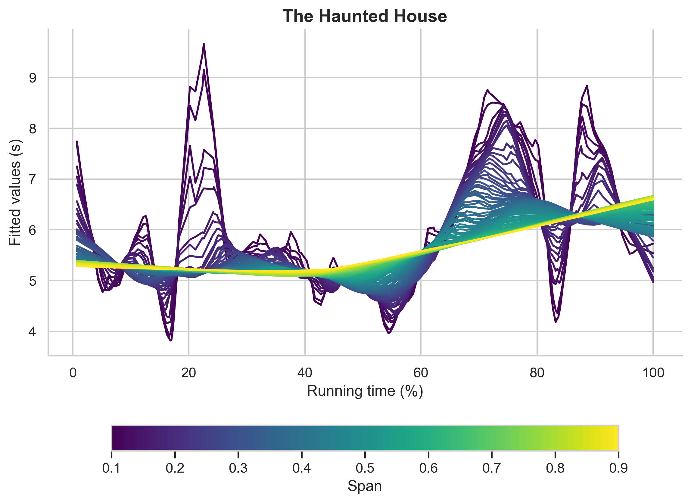

# multiloess
**multiloess** is a streamlit app for fitting multiple loess smoothers to motion picture shot length data.

The app is easy to use:

* Upload a csv file containing shot length data in wide format (i.e., one column per film). `NAs` are removed automatically.
* Select the film for which you want to plot the data.
* Set the range of the loess smoothers by moving the sliders.
* The step parameter determines the increase between consecutive smoothers across the range.
* The ticks parameter is purely cosmetic, controlling the spacing of the tick labels on the colour bar, but is useful for creating clear plots.
* Add a title for your plot.

When you're ready to go, click *Visualise*.

The resulting plot will look like this:

When you're happy with the output, click *Download my plot* to save the plot as a `png` file (resolution = 300 dpi).

(Because every action in a streamlit app re-runs the whole app the plot will disappear but it will be saved to your default Downloads folder).

## Check out similar functions at multiloesssmoothers
My GitHub repository [DrNickRedfern/multiloesssmoothers](https://github.com/DrNickRedfern/multiloesssmoothers) has a Python script to create this plot if you want to use it.

There are also functions to produce multiloess plots of movie shot length data in`R` and `Julia`.
